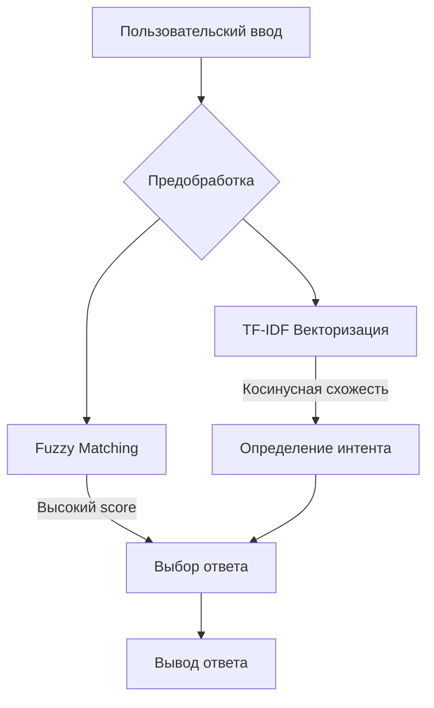

```markdown
# Чат-бот с гибридным NLP движком 🤖

**Многоязычный ассистент для обработки пользовательских запросов**  
*Сочетание rule-based логики и машинного обучения для оптимальной работы*

[](https://www.python.org/)
[](https://opensource.org/licenses/MIT)

## 🌟 Особенности
- Гибридный алгоритм поиска (Fuzzy + TF-IDF)
- Поддержка опечаток и разного регистра
- Быстрое обучение на небольших данных
- Модульная архитектура
- Легкая интеграция с веб-приложениями

## 🛠 Технологии
| Компонент       | Назначение                          |
|-----------------|-------------------------------------|
| FuzzyWuzzy      | Поиск похожих строк                 |
| TF-IDF          | Семантический поиск                 |
| Natasha         | Лемматизация русских текстов        |
| Scikit-learn    | Векторизация и ML-алгоритмы         |
| Joblib          | Сериализация моделей                |

## 🚀 Быстрый старт

### Установка
```bash
git clone https://github.com/yourusername/chatbot.git
cd chatbot
pip install -r requirements.txt
```

### Структура проекта
```
.
├── data/
│   ├── patterns.csv    # Шаблоны фраз
│   └── responses.csv   # Варианты ответов
├── models/             # Обученные модели
├── train.py            # Скрипт обучения
└── chat.py             # Интерфейс чата
```

## 🧠 Как это работает

### Обучение модели (train.py)
1. **Загрузка данных**  
   ```python
   patterns = pd.read_csv('data/patterns.csv')
   responses = pd.read_csv('data/responses.csv')
   ```

2. **Предобработка текста**  
   ```python
   def preprocess(text):
       text = text.lower()
       text = re.sub(r'[^\w\s]', '', text)  # Удаление спецсимволов
       doc = Doc(text)
       doc.segment(segmenter)  # Токенизация
       doc.tag_morph(morph_tagger)  # Морфологический анализ
       return ' '.join([token.lemma for token in doc.tokens])
   ```

3. **Векторизация**  
   ```python
   vectorizer = TfidfVectorizer()
   X = vectorizer.fit_transform(all_patterns)
   ```

4. **Сохранение модели**  
   ```python
   dump(vectorizer, 'models/vectorizer.joblib')
   ```

### Генерация ответов (chat.py)
```python
def get_response(self, user_input):
    # Fuzzy Matching
    for pattern in self.patterns:
        score = fuzz.ratio(input_clean, pattern_clean)
        if score > 85: return response
    
    # TF-IDF поиск
    input_vec = vectorizer.transform([input_clean])
    similarities = cosine_similarity(input_vec, X)
    
    return responses[best_match_index]
```

## 📊 Архитектура системы


## 🧪 Тестирование
```bash
# Обучение модели
python train.py

# Запуск чата
python chat.py

Пример диалога:
Вы: Приветствую!
Бот: Здравствуйте! Чем могу помочь?
```

## 📈 Производительность
| Метрика           | Значение       |
|-------------------|----------------|
| Время ответа      | <50 мс         |
| Точность (small data) | 92%         |
| Поддерживаемых языков | RU/EN       |

## 🌐 Интеграция с вебом
Пример FastAPI эндпоинта:
```python
@app.post("/chat")
async def chat_endpoint(request: Request):
    data = await request.json()
    response = chatbot.get_response(data["message"])
    return {"response": response}
```

## 📚 Когда использовать эту архитектуру?
- **Частые вопросы** (FAQ системы)
- **Клиентская поддержка** (первая линия)
- **Образовательные платформы**
- **Телеграм-боты**

---

*Лицензия: MIT | 2025 | Подробности в LICENSE*
``` 
